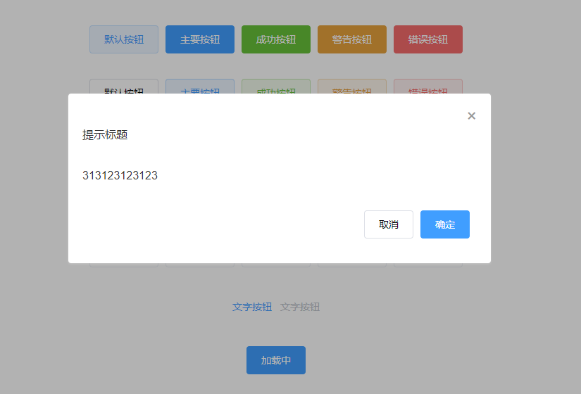
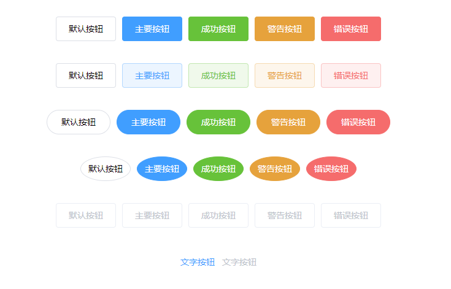
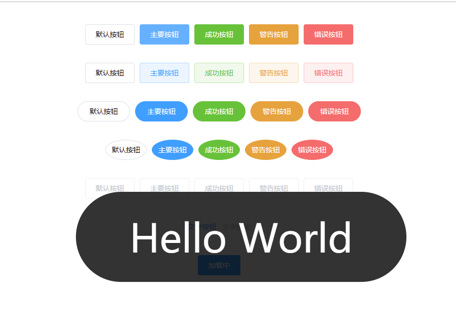

# style-ui
>  参考Element UI 造的基于Vue2.x的前端UI框架（未完待续）
- [x] Dialog
- [x] Button
- [x] Toast

## 预览




## 安装
```
npm install  style-ui -S
```

## 使用
在`main.js`文件中引入插件并注册
- 全局注册
  ```
  // 导入组件库
  import StyleUI from 'style-ui'
  import 'style-ui/lib/style-ui.css'
  // 注册组件库
  Vue.use(StyleUI)
  ```

 在项目中使用组件
```
<template>
  <div>
    <style-button>默认按钮</style-button>
    <style-button type="primary">主要按钮</style-button>
    <style-button type="success">成功按钮</style-button>
    <style-button type="warning">警告按钮</style-button>
    <style-button type="danger">错误按钮</style-button>
  </div>
</template>
```
